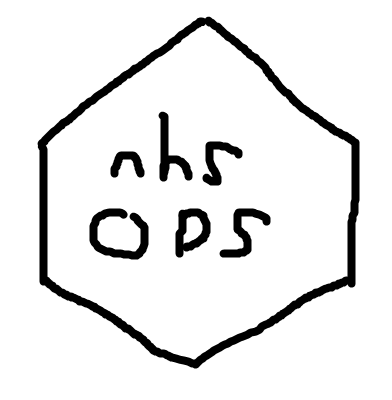

---
  output:
     xaringan::moon_reader:
      seal: false
      css: [default, matt1.css]
      yolo: false
      charkra: libs/remark-latest.min.js
---

# APIs in R
## Matthew Bass
### Healthcare Evaluation Data (HED),<br>University Hospitals Birmingham (UHB)
## 27/09/2019
Matthew.Bass@uhb.nhs.uk

---

## API What?

<center>

<p>"Application Programming Interface"</p>
--
<p>`=`</p>

<p>Method for one thing to talk to another thing</p>
--
<p>`=`</p>

<p>Websites</p>

</center>

---

## Surfing the World Wide Web

```{r load_google, results = "hide", echo = TRUE}
# R uses a library called httr to control sending
# and recieving HTTP requests
library(httr)

# The command you will use the most for APIs is GET()
# This command will return the reply from the server
# as a list.

webpage.raw <- GET(url="https://www.google.com")
```

---

## Get: google.com


---

## Got: Whatever This Is


```{r see_google, echo = FALSE}
str(webpage.raw)
```

---

## HTTP Replies

- url
- status_code
- request
- cookies
- content

---

## Content

```{r content_google, echo = FALSE}
webpage.raw[["content"]]
```

---

## Content.Decoded

```{r decode_google_fake, echo = TRUE, eval = FALSE}
# content() is part of httr
content(webpage.raw, "text")
```

--

```{r decode_google, echo = FALSE}
content(webpage.raw, "text")
```

---

## NHS Organisation Data Service (ODS)

Note: I am not affiliated in any way with the ODS


---

## NHS ODS ORD API

```{r first_API}
# The API gives the url of the 'Endpoint':
#   the address to send requests to the server.
url <- "https://directory.spineservices.nhs.uk/ORD/2-0-0/organisations?"

GET(url = url)
```

---

## Add Parameters

```{r first_parameters}
# Parameters go on the end
url <- "https://directory.spineservices.nhs.uk/ORD/2-0-0/organisations?PostCode=B15"

GET(url = url)
```

---

## Our First API Reply

```{r decode_parameters_1, echo = TRUE, warning=FALSE, message=FALSE}
url <- "https://directory.spineservices.nhs.uk/ORD/2-0-0/organisations?PostCode=B15"
API.raw <- GET(url = url)
API.decoded <- content(API.raw)
str(API.decoded)
```

---

```{r decode_parameters_2, warning=FALSE, message=FALSE}
library(jsonlite)
API.decoded <- fromJSON(content(API.raw, 'text'))
```

```{r decode_parameters_2_table, echo = FALSE, results = 'asis'}
#knitr::kable(API.decoded[["Organisations"]])
DT::datatable(API.decoded[["Organisations"]],
              options = list(scrollY = 300,
                             scrollX = TRUE,
                             dom = "<'top'>t<'bottom'>ip"))
```

---

```{r parameters_list}
parameters <- list(PostCode = "B15",
                   Limit = 100)

url <- "https://directory.spineservices.nhs.uk/ORD/2-0-0/organisations?"
API.raw <- GET(url = url, query = parameters)
```

```{r parameterslist_reply, echo = FALSE, warning=FALSE, message=FALSE}
API.decoded <- fromJSON(content(API.raw, 'text'))
#knitr::kable(API.decoded[["Organisations"]])
DT::datatable(API.decoded[["Organisations"]],
              options = list(scrollY = 300,
                             scrollX = TRUE,
                             dom = "<'top'>t<'bottom'>ip"))
```

---

## Lessons Learned

--

- .large-text[Each API has its own rules, parameters and formats.]

--

- .large-text[JSON is common but you may find XML, CSV and others.]

--

- .large-text[Some APIs require an identifier token. Use httr to include it in the GET request.]

--

- .large-text[An undocumented API is worse than useless]

--

- .large-text[For large data sets it is **much** faster to download one large file than to make lots of API requests. Use TRUD.]


---

## nhsODS R Package
.pull-left[


]

.pull-right[
- Download updated organisation details
- Read TRUD XML files into a relational database structure
- Combine TRUD data with:
  * OS grid numbers
  * GPS coordinates
  * STP organisation
  * Post code based political boundaries
- Still not affiliated with the ODS
]

```{r install_from_github, eval = FALSE, echo = TRUE}
library(devtools)
install_github(repo = "BassEngD/nhsODS")
```

---

## Download Organisation Details

```{r load_package, echo = FALSE, warning=FALSE, message=FALSE}
library(nhsODS)
```

```{r get_org_1, echo = TRUE, message=FALSE, warning=FALSE, results='hide'}
RRK_details <- get_organisation_details("RRK")
```

```{r get_org_2, echo = FALSE}
# str(RRK_details, max.level = 1,
#     give.attr = FALSE,
#     no.list = TRUE,
#     give.length = FALSE
#     )

RRK_details_summary <- data.frame(data.frame = names(RRK_details),
                                  observations = sapply(X = RRK_details, FUN = nrow),
                                  variables = sapply(X = RRK_details, FUN = ncol),
                                  stringsAsFactors = FALSE,
                                  row.names = NULL)

DT::datatable(RRK_details_summary,
              options = list(scrollX = TRUE,
                             searching = FALSE,
                             dom = "<'top'>t<'bottom'>"))
```

---

### organisation_details

```{r org_details, echo = FALSE}
DT::datatable(RRK_details$organisation_details,
              rownames = FALSE,
              options = list(scrollX = TRUE,
                             searching = FALSE,
                             dom = "<'top'>t<'bottom'>"))
```


### organisation_roles

```{r org_roles, echo = FALSE}
DT::datatable(RRK_details$organisation_roles,
              rownames = FALSE,
              filter = "none",
              options = list(scrollX = TRUE,
                             searching = FALSE,
                             dom = "<'top'>t<'bottom'>"))
```

---

### organisation_relationships

```{r org_rels, echo = FALSE}
DT::datatable(RRK_details$organisation_relationships,
              rownames = FALSE,
              filter = "none",
              options = list(scrollX = TRUE,
                             searching = FALSE,
                             dom = "<'top'>t<'bottom'>"))
```

### organisation_successors

```{r org_succs, echo = FALSE}
DT::datatable(RRK_details$organisation_successors,
              rownames = FALSE,
              filter = "none",
              options = list(scrollX = TRUE,
                             searching = FALSE,
                             dom = "<'top'>t<'bottom'>"))
```

---

## Parse TRUD XML

```{r parse_xml_1}

xml_document <- parse_ODS_XML("pres-figure/ODS_XML_EG.xml")

```

```{r parse_xml_2, echo = FALSE}

XML_summary <- data.frame(data.frame = names(xml_document),
                                  observations = sapply(X = xml_document, FUN = nrow),
                                  variables = sapply(X = xml_document, FUN = ncol),
                                  stringsAsFactors = FALSE,
                                  row.names = NULL)

DT::datatable(XML_summary,
              options = list(scrollX = TRUE,
                             scrollY = 400,
                             searching = FALSE,
                             dom = "<'top'>t<'bottom'>",
                             pageLength = 15))
```

---

## APIs in R

.large-text[
- APIs let programs talk to each other
- `R` can talk to web-based APIs with `httr`
- `GET()` to request data
- `content()` to read the reply
- Reply can be: JSON, XML, csv, and many more
- Parse the reply into an R-readable format
- Use data
- Make packages of useful functions for important APIs
]
Examples: `fingertipsR`, `SPARQL`, `gmailr`

Email: Matthew.Bass@uhb.nhs.uk